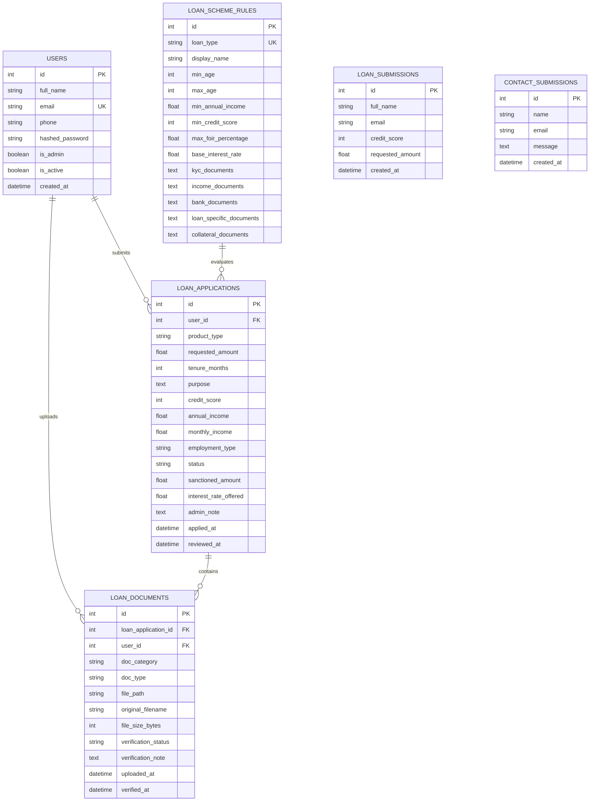

# Comprehensive Backend Architecture, API Reference & Interview Guide
### **Project**: Loan Management & Intelligent Underwriting System (`TEAM-DSA`)
### **Target**: Hackathon Technical Presentation & Deep-Dive Viva

---

## 1. Executive Summary & Tech Stack

The backend is built as a high-performance, asynchronous RESTful service using **FastAPI (Python 3.10+)**, **SQLAlchemy 2.0 (ORM)**, **Pydantic V2 (Data Validation & Serialization)**, **JWT + Bcrypt (Security & Access Control)**, and an integrated **Machine Learning Inference Pipeline (XGBoost / Scikit-Learn)**.

```mermaid
flowchart TD
    Client["Client (Browser / SPA / Postman)"] -->|HTTP / JSON / Multipart| FastAPI["FastAPI Gateway (Uvicorn ASGI)"]
    
    subgraph Middlewares & Security
        FastAPI --> CORS["CORSMiddleware (Origins, Headers, Methods)"]
        CORS --> AuthDep["Auth Dependency (OAuth2 Bearer / JWT Decryption)"]
        AuthDep --> DBDriver["DB Session Dependency (get_db / SessionLocal)"]
    end

    subgraph Routers Layer (Controllers)
        DBDriver --> AuthRouter["Auth Router (/auth/*)"]
        DBDriver --> UserRouter["User & Loan Router (/loans/*)"]
        DBDriver --> AdminRouter["Admin & Underwriting Router (/admin/*)"]
        DBDriver --> MLRouter["ML Engine Router (/api/v1/*)"]
    end

    subgraph Service & Engine Layer (Business Logic)
        UserRouter --> EligEngine["Eligibility Engine (FOIR, Hard Rules, EMI)"]
        AdminRouter --> DocEngine["Document Management Engine (Multipart/Disk/SVG)"]
        MLRouter --> MLModel["ML Risk Classifier (XGBoost, CalibratedClassifierCV, SHAP)"]
    end

    subgraph Data Access Layer (ORM & Persistence)
        EligEngine --> ORM["SQLAlchemy 2.0 Models"]
        DocEngine --> ORM
        AuthRouter --> ORM
        ORM --> SQLite[("SQLite / PostgreSQL Engine (WAL Mode, Thread-Safe)")]
        DocEngine --> DiskStorage[("Local Document Storage (/uploads)")]
    end
```

---

## 2. Architecture: Layered & Modular MVC Pattern

Although FastAPI is a modern micro-framework, this codebase adheres strictly to the **Layered Clean Architecture (Modern MVC)**:

| Layer | Files in Codebase | Role & Responsibility |
| :--- | :--- | :--- |
| **Presentation / Router (Controller)** | `routers/auth_router.py`<br>`routers/user_router.py`<br>`routers/admin_router.py`<br>`ml/src/api/routes.py` | Routes HTTP requests, parses headers/parameters, enforces route-level authentication, and delegates to business logic. |
| **Validation & DTO (Data Transfer Objects)** | `schemas.py`<br>`ml/src/api/schemas.py` | Pydantic V2 models. Validates incoming request types, bounds, strings, dates, and serializes output models safely. |
| **Domain Logic / Service Engine** | `eligibility_engine.py`<br>`auth.py`<br>`ml/src/explainability/` | Computes FOIR, Reducing Balance EMIs, Hard Criteria filtering, Password Hashing, JWT minting/decoding, and SHAP explainability. |
| **Data Access Layer (Model)** | `database.py` | SQLAlchemy ORM entity definitions, relationships, foreign keys, database engine initialization, and WAL journal configuration. |
| **Storage / Assets** | `backend/uploads/`<br>`frontend/` | File-system based physical document storage and static asset delivery. |

---

## 3. How Data Flows from Request to Database (CRUD Lifecycle)

### **Example: Applying for a Loan (`POST /loans/apply`)**
1. **HTTP Ingestion**: Client sends `POST http://127.0.0.1:8000/loans/apply` with `Authorization: Bearer <JWT>` and JSON payload.
2. **CORS & Pre-flight**: `CORSMiddleware` inspects headers (`Origin`, `Access-Control-Allow-Methods`).
3. **Dependency Injection**: 
   - `get_current_user` in [`auth.py`](file:///c:/Users/Aditya/OneDrive/AppData/Documents/Desktop/TEAM-DSA/backend/auth.py) extracts the token, verifies the signature with `SECRET_KEY` + `HS256`, and fetches the user record.
   - `get_db` opens an isolated SQLAlchemy `Session` bound to the engine.
4. **Pydantic Validation**: `LoanApplicationCreate` in [`schemas.py`](file:///c:/Users/Aditya/OneDrive/AppData/Documents/Desktop/TEAM-DSA/backend/schemas.py) parses and validates constraints (e.g. `requested_amount > 0`, valid `product_type`, tenure ranges). If invalid, FastAPI halts and returns `422 Unprocessable Entity`.
5. **Business Logic Execution**:
   - Computes monthly income if annual income is provided (`annual_income / 12`).
   - Calculates applicant's FOIR (Fixed Obligation to Income Ratio).
6. **ORM Mapping & Transaction**:
   - Creates a new `LoanApplication` model instance.
   - `db.add(new_loan)` stages the record.
   - `db.commit()` commits the database transaction (writing to SQLite WAL / Postgres).
   - `db.refresh(new_loan)` reloads generated primary key (`id`) and server defaults.
7. **Response Serialization**:
   - Maps database entity into `LoanApplicationOut` Pydantic schema, hiding sensitive internals and formatting datetime objects into ISO 8601 strings.
   - Returns `201 Created` with JSON body.

---

## 4. Database Schema & Entity Relationships

The schema consists of **6 primary tables**:



---

## 5. Complete REST API Catalog

### **A. Authentication (`/auth`)**
| HTTP Method | Endpoint | Access | Description | Request Body | Response Code |
| :--- | :--- | :--- | :--- | :--- | :--- |
| `POST` | `/auth/register` | Public | Register new borrower | `{ full_name, email, password, phone }` | `201 Created` |
| `POST` | `/auth/login` | Public | Authenticate user & issue JWT | `{ email, password }` | `200 OK` |
| `GET` | `/auth/me` | Authenticated | Fetch current user's profile | *None* | `200 OK` |

### **B. Borrower & Loan Operations (`/loans`)**
| HTTP Method | Endpoint | Access | Description | Request Body / Params | Response Code |
| :--- | :--- | :--- | :--- | :--- | :--- |
| `GET` | `/loans/schemes` | Public | Fetch all 6 official loan schemes | *None* | `200 OK` |
| `POST` | `/loans/recommend` | Public | Multi-criteria eligibility assessment & FOIR ranking | `EligibilityInput` (Age, City, Income, Credit, EMI) | `200 OK` |
| `POST` | `/loans/apply` | Borrower | Submit loan application | `LoanApplicationCreate` (Product, Amount, Tenure, Specifics) | `201 Created` |
| `GET` | `/loans/my` | Borrower | List current borrower's loan applications | *None* | `200 OK` |
| `GET` | `/loans/{id}` | Borrower/Admin | Get detailed application by ID | *Path param: `id`* | `200 OK` |
| `POST` | `/loans/{id}/documents` | Borrower | Upload KYC / Income / Collateral file | `Multipart/form-data` (`file`, `doc_category`) | `201 Created` |
| `GET` | `/loans/{id}/documents` | Borrower/Admin | List documents uploaded for application | *Path param: `id`* | `200 OK` |
| `DELETE`| `/loans/{id}/documents/{doc_id}` | Borrower | Delete pending document | *Path params: `id`, `doc_id`* | `200 OK` |

### **C. Admin & Underwriting (`/admin`)**
| HTTP Method | Endpoint | Access | Description | Request Body / Params | Response Code |
| :--- | :--- | :--- | :--- | :--- | :--- |
| `GET` | `/admin/loans` | Admin | Underwriting portfolio with status filtering | `?status=pending` (Optional) | `200 OK` |
| `PATCH`| `/admin/loans/{id}/approve` | Admin | Sanction loan with custom amount & interest rate | `{ sanctioned_amount, interest_rate_offered, admin_note }` | `200 OK` |
| `PATCH`| `/admin/loans/{id}/reject` | Admin | Reject loan with remarks | `{ admin_note }` | `200 OK` |
| `PATCH`| `/admin/loans/{id}/documents/{doc_id}/verify` | Admin | Mark document as verified or rejected | `{ verification_status, verification_note }` | `200 OK` |
| `GET` | `/admin/loans/{id}/documents/{doc_id}/view` | Admin/Bearer | View/Inspect document preview | `?token=<JWT>` | `200 OK` (Image/PDF/SVG) |
| `GET` | `/admin/loans/{id}/documents/{doc_id}/download` | Admin/Bearer | Download original file | `?token=<JWT>` | `200 OK` (File Attachment) |
| `GET` | `/admin/stats` | Admin | Portfolio analytics & approval counts | *None* | `200 OK` |
| `GET` | `/admin/users` | Admin | List all registered borrowers | *None* | `200 OK` |

### **D. ML & Explainable AI (`/api/v1`)**
| HTTP Method | Endpoint | Access | Description | Response Code |
| :--- | :--- | :--- | :--- | :--- |
| `POST` | `/api/v1/recommend` | Public | ML-driven risk scoring & approval probability | `200 OK` |
| `GET` | `/api/v1/health` | Public | ML pipeline model health & artifact status | `200 OK` |
| `POST` | `/api/v1/reload-models` | Admin | Reload ML pickle/booster weights dynamically | `200 OK` |

---

## 6. HTTP Methods, Status Codes & Headers Explained

### **HTTP Methods Used in our Codebase**
- `GET`: Idempotent & safe. Retrieves resources (e.g. `GET /loans/schemes`, `GET /admin/stats`). Contains no request body.
- `POST`: Non-idempotent. Creates new records or triggers computation (e.g. `POST /auth/register`, `POST /loans/apply`, `POST /loans/{id}/documents`).
- `PATCH`: Modifies partial attributes of an existing entity without overwriting the entire resource (e.g. `PATCH /admin/loans/{id}/approve` only updates `status`, `sanctioned_amount`, `interest_rate_offered`, and `admin_note`).
- `DELETE`: Removes a resource permanently (e.g. `DELETE /loans/{id}/documents/{doc_id}`).

### **HTTP Status Codes Handled**
- `200 OK`: Successful retrieval or update.
- `201 Created`: Resource successfully created (`User`, `LoanApplication`, `LoanDocument`).
- `400 Bad Request`: Business rule violation (e.g. "Email already registered", "Invalid loan category").
- `401 Unauthorized`: Missing, invalid, or expired JWT token.
- `403 Forbidden`: Authenticated user lacks permission (e.g. non-admin attempting underwriting approval).
- `404 Not Found`: Entity does not exist (e.g. Loan ID or Document ID not in database).
- `422 Unprocessable Entity`: Pydantic validation failure (e.g. string sent where integer expected).
- `500 Internal Server Error`: Unhandled server/database exception.

---

## 7. Hackathon Interview Questions & Model Answers

### **Q1: Why did you choose FastAPI over Flask or Django?**
> **Answer**: 
> 1. **High Throughput & Async Native**: FastAPI is built on Starlette and Uvicorn (ASGI), giving performance comparable to Node.js and Go.
> 2. **Automatic Data Validation**: Uses Pydantic V2 for strict type checking and serialization, preventing runtime data bugs.
> 3. **Auto-Generated OpenAPI/Swagger**: Gives interactive docs at `/docs` and `/redoc` out-of-the-box without writing manual YAML.
> 4. **Dependency Injection System**: Makes database sessions and auth token validations reusable across routes with zero boilerplate.

### **Q2: How does the Eligibility & Underwriting Engine work?**
> **Answer**:
> The engine operates in **3 distinct stages**:
> 1. **Hard Eligibility Filtering**: Checks borrower against scheme minimums (Age bounds, Minimum Income, Minimum Credit Score, and Maximum FOIR).
> 2. **Financial Math & FOIR Calculation**:
>    $$\text{FOIR (\%)} = \frac{\text{Existing EMIs} + \text{Proposed EMI}}{\text{Monthly Income}} \times 100$$
>    Calculates reducing balance monthly EMI:
>    $$\text{EMI} = \frac{P \cdot r \cdot (1+r)^n}{(1+r)^n - 1}$$
> 3. **Dynamic Scoring & Ranking**: If eligible, ranks schemes based on low interest rates, applicant preference, and credit match. If ineligible, generates specific remediation tips (e.g. "Increase credit score by 35 points or lower tenure").

### **Q3: How do you handle Authentication and Authorization securely?**
> **Answer**:
> - **Passwords**: Never stored in plain text. Hashed using **`bcrypt`** via `passlib` with cryptographic salt.
> - **Tokens**: Stateless **`JSON Web Tokens (JWT)`** signed with `HS256` containing `sub` (user email), `id`, `is_admin`, and `exp` timestamp.
> - **Role-Based Access Control (RBAC)**: Route dependencies `get_current_user` and `get_current_admin` verify token validity and ensure regular borrowers cannot access `/admin/*` underwriting endpoints.

### **Q4: How do you manage Database Concurrency and Transactions in SQLite?**
> **Answer**:
> - We enable **`WAL (Write-Ahead Logging)`** mode and set `busy_timeout=5000ms` via SQLite PRAGMA event listeners on connection.
> - Session lifecycle is managed using Python generator dependencies (`yield db` inside a `try/finally` block), guaranteeing every session is closed after the request lifecycle.

### **Q5: How does the Document Storage & Inspection Pipeline work?**
> **Answer**:
> - Files are uploaded via `multipart/form-data` streams using `FastAPI.UploadFile`.
> - The file metadata (filename, category, MIME type, size, upload timestamp) is committed to the `loan_documents` table, and the binary file is stored in `backend/uploads/`.
> - For document inspection, our underwriter view features inline PDF iframe streaming, image rendering, and a dynamically generated cryptographic SVG fallback verification sheet.

### **Q6: How is the Machine Learning Model integrated into the Backend?**
> **Answer**:
> - Trained artifacts (`xgboost_model.pkl`, `calibrated_model.pkl`, `preprocessor.pkl`) are loaded into memory on server startup.
> - The `/api/v1/recommend` endpoint transforms raw applicant tabular inputs using `ColumnTransformer` (scaling numerical features and one-hot encoding categorical ones) and passes them to the calibrated XGBoost model for risk probability and SHAP-based feature importance breakdown.

### **Q7: What steps would you take to scale this backend to 100,000 requests/minute in production?**
> **Answer**:
> 1. **Database**: Swap SQLite for a managed **PostgreSQL cluster with Read Replicas** and **PgBouncer** connection pooling.
> 2. **Caching**: Place **Redis** in front of `/loans/schemes` and `/loans/recommend` to cache static policy rules and repeated calculations.
> 3. **Async Task Queue**: Offload document OCR, KYC checks, and heavy SHAP computations to **Celery / Redis workers**.
> 4. **Storage**: Move file storage from local disk to **AWS S3 / Google Cloud Storage** with pre-signed URLs.
> 5. **Containerization & Auto-scaling**: Deploy containerized FastAPI pods on **Kubernetes (EKS/GKE)** behind an **NGINX / AWS ALB** reverse proxy with horizontal pod autoscaling (HPA).

---

## 8. Summary Checklist for Presentation Day

- [x] **API Base URL**: `http://127.0.0.1:8000`
- [x] **Interactive Documentation**: `http://127.0.0.1:8000/docs`
- [x] **Admin Test Credentials**: `admin@loanapp.com` / `Admin@123`
- [x] **Borrower Test Credentials**: `ravi@example.com` / `MyPass@123`
- [x] **6 Supported Loan Categories**: Home Loan, Personal Loan, Vehicle Loan, Education Loan, Business/MSME Loan, Gold Loan.
- [x] **Unit & Integration Test Suite**: 9/9 passing tests in `tests/test_backend.py` and `tests/test_ml_integration.py`.
