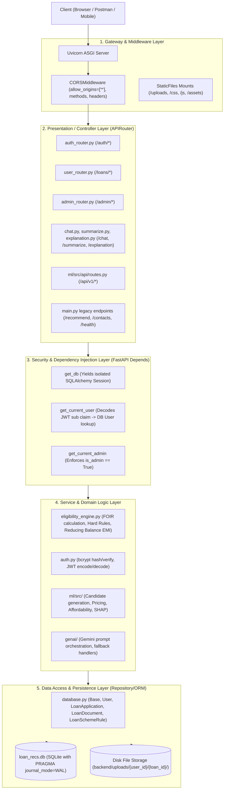
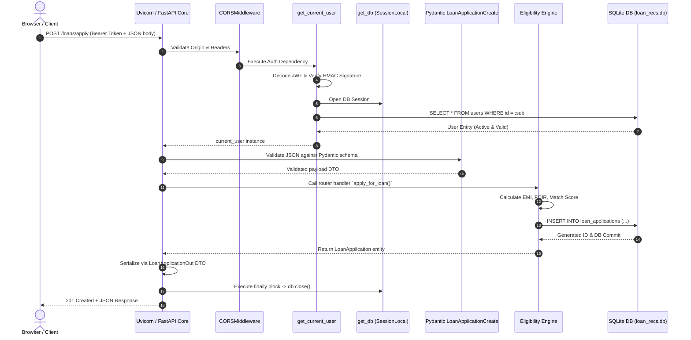

# 🏛️ Complete Backend Master Guide & Interview Encyclopedia
### **Project**: Loan Management & Intelligent Underwriting System (`TEAM-DSA`)
### **Purpose**: Exhaustive Reference for Technical Interviews, Architecture Reviews & Deep-Dive Oral Exams

---

## 📑 Table of Contents
1. [Backend Technology Stack (Complete Breakdown)](#1-backend-technology-stack-complete-breakdown)
2. [High-Level Architecture & Layered MVC Pattern](#2-high-level-architecture--layered-mvc-pattern)
3. [Database Architecture, Tables & Schemas](#3-database-architecture-tables--schemas)
4. [Master API Routes Table (All HTTP Methods, Auth, Schemas & Status Codes)](#4-master-api-routes-table)
5. [Imported vs Non-Imported (Legacy) Routes Breakdown](#5-imported-vs-non-imported-legacy-routes-breakdown)
6. [Security, Authentication & Authorization (JWT + Bcrypt)](#6-security-authentication--authorization)
7. [Dependency Injection & FastAPI Request Lifecycle](#7-dependency-injection--fastapi-request-lifecycle)
8. [Core Backend Concepts Explained (Interview Must-Knows)](#8-core-backend-concepts-explained)
9. [Top 25 Backend Interview Questions & Model Answers (Based on this Codebase)](#9-top-25-backend-interview-questions--model-answers)

---

## 1. Backend Technology Stack (Complete Breakdown)

| Category | Technology / Library | Version Used | Purpose & Why It Was Chosen |
| :--- | :--- | :--- | :--- |
| **Framework** | `FastAPI` | `0.141.1` | Modern, high-performance web framework for building APIs with Python 3.10+ based on standard Python type hints and ASGI standard. Extremely fast (on par with NodeJS and Go). |
| **ASGI Web Server** | `uvicorn` | `0.52.2` | Lightning-fast ASGI (Asynchronous Server Gateway Interface) server implementation using `uvloop` and `httptools`. Handles incoming HTTP requests and concurrency. |
| **ORM (Object Relational Mapper)** | `SQLAlchemy` | `2.0.52` | Industry-standard Python SQL toolkit and Object Relational Mapper. Maps Python classes directly to database tables, handles connection pooling, migrations, and atomic transactions. |
| **Data Validation & DTOs** | `pydantic` | `2.13.4` | Data validation and parsing library using Python type annotations. Enforces strict type checking, sanitization, default values, and schema serialization with Rust-powered V2 engine. |
| **Database** | `SQLite 3` (with WAL Mode) | Embedded / Engine | Zero-configuration SQL database engine configured in Write-Ahead Logging (`WAL`) mode for high-concurrency multi-threaded read/write safety without lock contention. |
| **Token Authentication** | `python-jose[cryptography]` | `3.5.0` | Implements JSON Web Signature (JWS) and JSON Web Tokens (JWT) for stateless user session authentication (HMAC-SHA256 signing and expiration validation). |
| **Password Hashing** | `bcrypt` / `passlib` | `4.3.0` / `1.7.4` | Adaptive cryptographic password hashing algorithm with auto-generated salt factors to prevent rainbow table attacks and ensure resistant credential storage. |
| **Multipart File Ingestion** | `python-multipart` | `0.0.32` | Enables streaming multi-part form data uploads for documents (PDFs, JPGs, PNGs) via `UploadFile` and `File(...)`. |
| **AI / GenAI Engine** | `google-genai` | Latest | Google Gemini AI SDK for LLM-powered loan summarization, natural language underwriting explanations, and conversational chat grounded on loan context. |
| **ML Inference Pipeline** | `xgboost`, `scikit-learn`, `joblib`, `pandas` | `>=2.0.0`, `>=1.4.0` | Machine learning stack for borrower default risk prediction, feature engineering pipelines, affordability calculations, and SHAP explainability. |

---

## 2. High-Level Architecture & Layered MVC Pattern

The backend follows a **Clean Layered Architecture (Controller-Service-Repository / MVC)**:



---

## 3. Database Architecture, Tables & Schemas

### ⚙️ Database Engine Configuration (`backend/database.py`)
```python
engine = create_engine(
    DATABASE_URL, 
    connect_args={"check_same_thread": False, "timeout": 15}
)

@event.listens_for(engine, "connect")
def set_sqlite_pragma(dbapi_connection, connection_record):
    cursor = dbapi_connection.cursor()
    try:
        cursor.execute("PRAGMA journal_mode=WAL")        # Write-Ahead Logging for high concurrency
        cursor.execute("PRAGMA synchronous=NORMAL")      # Faster disk synchronization
        cursor.execute("PRAGMA busy_timeout=5000")       # Wait up to 5000ms if DB is locked
    finally:
        cursor.close()
```

---

### 🗄️ Database Tables (Entities) & Constraints

#### Table 1: `users`
Represents borrower accounts and system administrators.
| Column | Type | Constraints | Description |
| :--- | :--- | :--- | :--- |
| `id` | `INTEGER` | `PRIMARY KEY, AUTOINCREMENT, INDEX` | Unique User Identifier |
| `full_name` | `VARCHAR` | `NOT NULL` | Applicant's official full name |
| `email` | `VARCHAR` | `UNIQUE, INDEX, NOT NULL` | Unique login email (case-insensitive) |
| `phone` | `VARCHAR` | `NULLABLE` | Mobile number |
| `hashed_password` | `VARCHAR` | `NOT NULL` | Bcrypt hashed string (60 characters) |
| `is_admin` | `BOOLEAN` | `DEFAULT False` | Role flag (`True` = Underwriter/Admin, `False` = Borrower) |
| `is_active` | `BOOLEAN` | `DEFAULT True` | Account status flag |
| `created_at` | `DATETIME` | `DEFAULT utcnow()` | Account registration timestamp |
* **Relationships**: `loan_applications` (1-to-many cascade), `documents` (1-to-many cascade).

---

#### Table 2: `loan_scheme_rules`
Master policy rulebook seeded with 6 Indian banking loan products (`gold_loan`, `education_loan`, `business_loan`, `vehicle_loan`, `home_loan`, `personal_loan`).
| Column | Type | Constraints | Description |
| :--- | :--- | :--- | :--- |
| `id` | `INTEGER` | `PRIMARY KEY, INDEX` | Rule ID |
| `loan_type` | `VARCHAR` | `UNIQUE, INDEX, NOT NULL` | Identifier enum (e.g. `personal_loan`, `gold_loan`) |
| `display_name` | `VARCHAR` | `NOT NULL` | Human-friendly name |
| `min_age` / `max_age` | `INTEGER` | Defaults: `21` / `65` | Age boundary constraints |
| `min_annual_income` | `FLOAT` | Default: `0.0` | Minimum salary / turnover threshold |
| `min_credit_score` | `INTEGER` | Defaults: `550` to `680` | Minimum CIBIL score needed |
| `max_foir_percentage` | `FLOAT` | Defaults: `45%` to `70%` | Maximum Fixed Obligation to Income Ratio |
| `collateral_requirement` | `VARCHAR` | `NOT NULL` | `None` / `Optional` / `Mandatory` |
| `co_applicant_requirement` | `VARCHAR` | `NOT NULL` | `None` / `Optional` / `Mandatory` |
| `min_down_payment_percentage` | `FLOAT` | Defaults: `0%` to `25%` | Margin money requirement |
| `kyc_documents` | `TEXT` | `NOT NULL` | Comma-separated list of required KYC documents |
| `income_documents` | `TEXT` | `NOT NULL` | Comma-separated list of required income proofs |
| `bank_documents` | `TEXT` | `NOT NULL` | Required banking records (e.g. 6 months statement) |
| `loan_specific_documents` | `TEXT` | `NOT NULL` | Specialized proof (e.g. Admission letter, Vehicle quotation) |
| `collateral_documents` | `TEXT` | `NOT NULL` | Title deed, Gold assay receipt, Hypothecation form |
| `base_interest_rate` | `FLOAT` | Default rate | Base annual percentage rate (APR) |
| `min_amount` / `max_amount`| `FLOAT` | Range bounds | Minimum and maximum loan sanction limit |
| `min_tenure_months` / `max_tenure_months` | `INTEGER` | Range bounds | Tenure limits (e.g. 3 to 360 months) |
| `source_url` | `VARCHAR` | `NOT NULL` | Official RBI / Ministry regulatory policy source |
| `last_verified` | `VARCHAR` | `NOT NULL` | Compliance verification audit date |

---

#### Table 3: `loan_applications`
Core transactional table storing submitted loan applications across all 6 loan types.
| Column | Type | Constraints | Description |
| :--- | :--- | :--- | :--- |
| `id` | `INTEGER` | `PRIMARY KEY, INDEX` | Application Reference Number |
| `user_id` | `INTEGER` | `FOREIGN KEY(users.id), NOT NULL` | Belongs to User |
| `product_type` | `VARCHAR` | `INDEX, NOT NULL` | Loan type category |
| `requested_amount` | `FLOAT` | `NOT NULL` | Principal amount requested |
| `tenure_months` | `INTEGER` | `NOT NULL` | Repayment tenure in months |
| `purpose` | `TEXT` | `NULLABLE` | Borrower statement of purpose |
| `age`, `annual_income`, `monthly_income` | `INTEGER`/`FLOAT` | Financials | Borrower demographic & income snapshot |
| `employment_type`, `experience_years`, `credit_score`, `existing_emi` | Mixed | Financials | Creditworthiness & existing debt obligations |
| `has_co_applicant`, `co_applicant_name`, `co_applicant_income`, `co_applicant_pan` | Mixed | Co-borrower | Secondary applicant financial guarantees |
| `collateral_available`, `collateral_type`, `collateral_estimated_value` | Mixed | Security | Pledged asset specifications |
| `vehicle_type`, `vehicle_make_model`, `vehicle_on_road_price`, `dealer_name` | Mixed | Vehicle specifics | Auto loan asset details |
| `institution_name`, `course_name`, `course_country`, `total_fee_estimate` | Mixed | Education specifics | Student loan institution & course details |
| `business_name`, `business_type`, `business_vintage_years`, `annual_turnover`, `gst_number` | Mixed | MSME specifics | Business registration and financial metrics |
| `gold_weight_grams`, `gold_purity_karats`, `estimated_gold_market_value` | Mixed | Gold specifics | Gold weight, purity (18-24k) & appraised value |
| `property_type`, `property_value`, `property_city`, `property_address` | Mixed | Home specifics | Housing real estate specifications |
| `status` | `VARCHAR` | `DEFAULT 'pending', NOT NULL` | `pending` \| `under_review` \| `approved` \| `rejected` |
| `admin_note` | `TEXT` | `NULLABLE` | Underwriter remarks / rejection reason |
| `sanctioned_amount` | `FLOAT` | `NULLABLE` | Final approved loan amount |
| `interest_rate_offered`| `FLOAT` | `NULLABLE` | Final offered annual interest rate |
| `estimated_emi` | `FLOAT` | `NULLABLE` | Calculated monthly instalment |
| `eligibility_status` | `VARCHAR` | `DEFAULT 'eligible'` | Automated engine outcome (`eligible`, `conditionally_eligible`, `ineligible`) |
| `eligibility_score` | `FLOAT` | `DEFAULT 80.0` | Match score (0 to 100) |
| `eligibility_remarks` | `TEXT` | `NULLABLE` | Automated rule audit log |
| `applied_at` / `reviewed_at` | `DATETIME` | Timestamps | Application and decision timestamps |
* **Relationships**: `applicant` (`User`), `documents` (`LoanDocument` cascade).

---

#### Table 4: `loan_documents`
Tracks supporting files uploaded for KYC, income, collateral, and loan-specific verification.
| Column | Type | Constraints | Description |
| :--- | :--- | :--- | :--- |
| `id` | `INTEGER` | `PRIMARY KEY, INDEX` | Document Record ID |
| `loan_application_id` | `INTEGER` | `FOREIGN KEY(loan_applications.id), NOT NULL` | Linked application |
| `user_id` | `INTEGER` | `FOREIGN KEY(users.id), NOT NULL` | Uploaded by user |
| `doc_category` | `VARCHAR` | `NOT NULL` | `kyc` \| `income` \| `bank` \| `loan_specific` \| `collateral` \| `other` |
| `doc_type` | `VARCHAR` | `NOT NULL` | `pan_card`, `salary_slip`, `bank_statement`, `tax_itr`, etc. |
| `original_filename` | `VARCHAR` | `NOT NULL` | Original uploaded file name |
| `stored_filename` | `VARCHAR` | `NOT NULL` | Secure UUID prefixed file name on disk |
| `file_path` | `VARCHAR` | `NOT NULL` | Absolute server disk path |
| `file_size_bytes` | `INTEGER` | `DEFAULT 0` | File size in bytes |
| `mime_type` | `VARCHAR` | `NULLABLE` | Content type (`application/pdf`, `image/png`, etc.) |
| `verification_status` | `VARCHAR` | `DEFAULT 'pending'` | `pending` \| `verified` \| `rejected` |
| `verification_note` | `TEXT` | `NULLABLE` | Auditor verification remark |
| `uploaded_at` / `verified_at` | `DATETIME` | Timestamps | Upload and audit timestamps |

---

#### Table 5: `loan_submissions` (Legacy Backward Compatibility)
Maintained for legacy `/recommend` and `/contacts` endpoints.
| Column | Type | Description |
| :--- | :--- | :--- |
| `id` | `INTEGER (PK)` | Submission ID |
| `full_name`, `email`, `phone` | `VARCHAR` | Contact info |
| `credit_score`, `annual_income`, `employment_type` | Mixed | Financial info |
| `requested_amount`, `requested_tenure_months` | Mixed | Loan inquiry details |
| `top_recommendation_product`, `created_at` | Mixed | Recommendation outcome & timestamp |

---

## 4. Master API Routes Table

Below is the complete inventory of all HTTP routes defined across the entire application:

| # | HTTP Method | Endpoint Path | Router / Source File | Auth Required | Request Payload (DTO / Type) | Response Model / Type | HTTP Status Code | Description |
| :-: | :--- | :--- | :--- | :--- | :--- | :--- | :-: | :--- |
| **1** | `POST` | `/auth/register` | `auth_router.py` | None (Public) | `UserRegister` (JSON) | `UserOut` | `201 Created` | Register new borrower account with unique email and bcrypt password hash. |
| **2** | `POST` | `/auth/login` | `auth_router.py` | None (Public) | `UserLogin` (JSON) | `Token` | `200 OK` | Authenticate user, return JWT access token, user details, and `is_admin` flag. |
| **3** | `GET` | `/auth/me` | `auth_router.py` | Bearer JWT (Any User) | None | `UserOut` | `200 OK` | Get logged-in user profile details from token claims. |
| **4** | `GET` | `/loans/schemes` | `user_router.py` | None (Public) | None | `List[LoanSchemeRuleOut]` | `200 OK` | Fetch all 6 official loan schemes with regulatory criteria & required document checklists. |
| **5** | `GET` | `/loans/schemes/{loan_type}` | `user_router.py` | None (Public) | Path Param: `loan_type` | `LoanSchemeRuleOut` | `200 OK` | Fetch specific scheme rules (e.g. `gold_loan`, `home_loan`) by loan type. |
| **6** | `POST` | `/loans/check-eligibility` | `user_router.py` | None (Public) | `EligibilityCheckRequest` (JSON) | `EligibilityCheckResponse` | `200 OK` | Real-time multi-loan evaluation pipeline: hard rule filtering, FOIR calculation, ranking. |
| **7** | `POST` | `/loans/apply` | `user_router.py` | Bearer JWT (Borrower) | `LoanApplicationCreate` (JSON) | `LoanApplicationOut` | `201 Created` | Submit full loan application across any of 6 categories with automated initial score. |
| **8** | `GET` | `/loans/my` | `user_router.py` | Bearer JWT (Borrower) | None | `List[LoanApplicationOut]` | `200 OK` | Retrieve all loan applications submitted by logged-in user with status & document list. |
| **9** | `GET` | `/loans/{loan_id}` | `user_router.py` | Bearer JWT (Owner/Admin) | Path Param: `loan_id` | `LoanApplicationOut` | `200 OK` | Get full details of a single loan application (ownership protected). |
| **10** | `POST` | `/loans/{loan_id}/documents` | `user_router.py` | Bearer JWT (Owner/Admin) | `multipart/form-data` (`file`, `doc_category`, `doc_type`) | `DocumentOut` | `201 Created` | Upload supporting proof (PDF/image) to disk storage and attach to loan. |
| **11** | `GET` | `/loans/{loan_id}/documents` | `user_router.py` | Bearer JWT (Owner/Admin) | Path Param: `loan_id` | `List[DocumentOut]` | `200 OK` | List all documents uploaded for a specific loan application. |
| **12** | `DELETE` | `/loans/{loan_id}/documents/{doc_id}` | `user_router.py` | Bearer JWT (Owner/Admin) | Path Params: `loan_id`, `doc_id` | None | `204 No Content` | Delete an uploaded document file from disk and database record. |
| **13** | `GET` | `/admin/loans` | `admin_router.py` | Bearer JWT (`is_admin=True`) | Query Params: `status`, `product_type`, `search` | `List[LoanApplicationOut]` | `200 OK` | Admin list/search/filter all loan applications across the entire system. |
| **14** | `GET` | `/admin/loans/{loan_id}` | `admin_router.py` | Bearer JWT (`is_admin=True`) | Path Param: `loan_id` | `LoanApplicationOut` | `200 OK` | Admin inspect single loan with full applicant details and all uploaded documents. |
| **15** | `PATCH` | `/admin/loans/{loan_id}/status` | `admin_router.py` | Bearer JWT (`is_admin=True`) | Path Param: `loan_id`, `AdminLoanUpdate` (JSON) | `LoanApplicationOut` | `200 OK` | Update loan status (`approved`, `rejected`, `under_review`, `pending`) with notes/terms. |
| **16** | `PUT` | `/admin/loans/{loan_id}/status` | `admin_router.py` | Bearer JWT (`is_admin=True`) | Path Param: `loan_id`, `AdminLoanUpdate` (JSON) | `LoanApplicationOut` | `200 OK` | Alias for status update (idempotent PUT support). |
| **17** | `POST` | `/admin/loans/{loan_id}/approve` | `admin_router.py` | Bearer JWT (`is_admin=True`) | Path Param: `loan_id`, `AdminLoanUpdate` (JSON) | `LoanApplicationOut` | `200 OK` | Fast-track approve loan with sanctioned amount and custom interest rate. |
| **18** | `POST` | `/admin/loans/{loan_id}/reject` | `admin_router.py` | Bearer JWT (`is_admin=True`) | Path Param: `loan_id`, `AdminLoanUpdate` (JSON) | `LoanApplicationOut` | `200 OK` | Reject loan with formal underwriter justification remark. |
| **19** | `GET` | `/admin/loans/{loan_id}/documents` | `admin_router.py` | Bearer JWT (`is_admin=True`) | Path Param: `loan_id` | `List[DocumentOut]` | `200 OK` | Admin inspect document verification status for a specific loan application. |
| **20** | `POST` | `/admin/loans/{loan_id}/documents/{doc_id}/verify` | `admin_router.py` | Bearer JWT (`is_admin=True`) | Path Params + `DocumentVerifyPayload` | `DocumentOut` | `200 OK` | Underwriter marks document as `verified` or `rejected` with audit note. |
| **21** | `GET` | `/admin/loans/{loan_id}/documents/{doc_id}/download` | `admin_router.py` | Bearer JWT / Query Token | Path Params: `loan_id`, `doc_id`, `token` | `FileResponse` / `SVG Response` | `200 OK` | Download document attachment with fallback dynamic SVG generator. |
| **22** | `GET` | `/admin/loans/{loan_id}/documents/{doc_id}/view` | `admin_router.py` | Bearer JWT / Query Token | Path Params: `loan_id`, `doc_id`, `token` | `FileResponse` / `Inline View` | `200 OK` | Inline preview document inside browser iframe / modal. |
| **23** | `GET` | `/admin/stats` | `admin_router.py` | Bearer JWT (`is_admin=True`) | None | `AdminStats` | `200 OK` | Executive analytics dashboard: volume counts, loan distribution, sanction totals. |
| **24** | `GET` | `/admin/users` | `admin_router.py` | Bearer JWT (`is_admin=True`) | None | `List[UserOut]` | `200 OK` | List all registered borrower accounts in the database. |
| **25** | `POST` | `/chat` | `routers/chat.py` | None (Public) | `ChatRequest` (`question`, `recommendation_context`) | `ChatResponse` | `200 OK` | GenAI Phase 3 grounded chat over recommendation context with SHAP alignment. |
| **26** | `POST` | `/summarize` | `routers/summarize.py` | None (Public) | `SummarizeRequest` (`top_recommendations`) | `SummarizeResponse` | `200 OK` | GenAI Phase 2 executive synthesis of loan offers using Google Gemini. |
| **27** | `POST` | `/explanation` | `routers/explanation.py`| None (Public) | `LoanRecommendationResponse` (JSON) | `ExplanationOutput` | `200 OK` | GenAI Phase 1 deterministic SHAP impact and feature contribution explanation. |
| **28** | `POST` | `/api/v1/recommend` | `ml/src/api/routes.py` | None (Public) | `LoanRecommendationRequest` (JSON) | `LoanRecommendationResponse` | `200 OK` | ML inference engine: feature pipeline, XGBoost risk score, pricing, ranking. |
| **29** | `GET` | `/api/v1/health` | `ml/src/api/routes.py` | None (Public) | None | `HealthResponse` | `200 OK` | ML model artifact health check (verifies risk model, ranking model, products file). |
| **30** | `POST` | `/api/v1/reload-models` | `ml/src/api/routes.py` | None (Public) | None | `dict` | `200 OK` | Hot-reload ML model pickles and preprocessor pipelines without server restart. |
| **31** | `GET` | `/health` | `main.py` (Direct) | None (Public) | None | `dict` | `200 OK` | Primary backend health check (`{"status": "ok", "version": "2.5.0"}`). |
| **32** | `GET` | `/contacts` | `main.py` (Direct) | None (Public) | None | `List[dict]` | `200 OK` | Legacy inquiry list (backward compatibility with earlier versions). |
| **33** | `POST` | `/recommend` | `main.py` (Direct) | None (Public) | `LoanRequest` (JSON) | `LoanResponse` | `200 OK` | Legacy single-loan recommendation & inquiry logger. |
| **34** | `GET` | `/` | `main.py` (Direct) | None (Public) | None | `FileResponse` / `HTML` | `200 OK` | Serves Single Page Application `frontend/index.html`. |

---

## 5. Imported vs Non-Imported (Legacy) Routes Breakdown

When an interviewer asks: *"How is your routing structured? Which routes are modularized (imported routers) versus defined directly in `main.py`?"*

### A. Imported Sub-Routers (`app.include_router(...)`)
1. **`auth_router`** (`backend/routers/auth_router.py`):
   - Prefixed with `/auth`.
   - Handles user registration, login JWT generation, and `/auth/me` identity resolution.
2. **`user_router`** (`backend/routers/user_router.py`):
   - Prefixed with `/loans`.
   - Handles scheme listing, real-time eligibility evaluation, borrower applications, and file uploads.
3. **`admin_router`** (`backend/routers/admin_router.py`):
   - Prefixed with `/admin`.
   - Handles underwriting decisions, loan approvals/rejections, document auditing, and portfolio analytics.
4. **`summarize_router`** (`backend/routers/summarize.py`):
   - Prefixed with `/summarize`.
   - GenAI LLM summary generator.
5. **`explanation_router`** (`backend/routers/explanation.py`):
   - Prefixed with `/explanation`.
   - GenAI SHAP explainability service.
6. **`chat_router`** (`backend/routers/chat.py`):
   - Prefixed with `/chat`.
   - Grounded chatbot conversational interface.
7. **`ml_router`** (`ml/src/api/routes.py`):
   - Prefixed with `/api/v1`.
   - XGBoost default risk scoring, pricing engine, affordability filtering, and candidate ranking.

### B. Non-Imported / Direct Routes (Defined directly in `backend/main.py`)
1. `GET /` — Serves the frontend single page app (`frontend/index.html`).
2. `GET /health` — Simple health check probe for load balancers and orchestrators.
3. `GET /favicon.ico` — Browser icon endpoint.
4. `POST /recommend` — Legacy recommendation endpoint maintained for backward compatibility.
5. `GET /contacts` — Legacy contact inquiry listing.

---

## 6. Security, Authentication & Authorization

### 🔐 Password Hashing (Bcrypt)
Passwords are never stored in plain text. When a user registers:
$$\text{Salt} = \text{os\_random}(16)$$
$$\text{Hashed Password} = \text{Bcrypt}(\text{password}, \text{salt})$$
- Bcrypt incorporates a work factor (default 12 rounds) making brute-force and rainbow table attacks computationally intractable.
- Password verification is constant-time via `_bcrypt.checkpw()`.

### 🛡️ JWT (JSON Web Token) Architecture
When `/auth/login` succeeds, a stateless signed JWT token is issued:

$$\text{JWT} = \underbrace{\text{Base64Url}(\text{Header})}_{\{\text{"alg": "HS256", "typ": "JWT"}\}} \,.\, \underbrace{\text{Base64Url}(\text{Payload})}_{\{\text{"sub": "user\_id", "exp": 1700000000}\}} \,.\, \underbrace{\text{Signature}}_{\text{HMAC-SHA256}(\text{Header}.\text{Payload}, \text{SECRET\_KEY})}$$

```
+-------------------------------------------------------------+
|                        JWT Structure                        |
+-------------------------------------------------------------+
| Header:    {"alg": "HS256", "typ": "JWT"}                  |
| Payload:   {"sub": "1", "exp": 1723900000}                  |
| Signature: HMACSHA256(Base64Url(Header) + "." +            |
|                       Base64Url(Payload), SECRET_KEY)       |
+-------------------------------------------------------------+
```

### 👮 Role-Based Access Control (RBAC) Dependency Chain
FastAPI resolves security cleanly through nested dependency injection:

```python
# 1. Base dependency: Extracts & verifies token, queries user from DB
def get_current_user(token: str = Depends(oauth2_scheme), db: Session = Depends(get_db)) -> User:
    payload = decode_token(token)
    user_id = payload.get("sub")
    user = db.query(User).filter(User.id == int(user_id)).first()
    if not user or not user.is_active:
        raise HTTPException(status_code=401, detail="Invalid credentials or disabled account")
    return user

# 2. Composed dependency: Enforces is_admin flag
def get_current_admin(current_user: User = Depends(get_current_user)) -> User:
    if not current_user.is_admin:
        raise HTTPException(status_code=403, detail="Admin access required")
    return current_user
```

---

## 7. Dependency Injection & FastAPI Request Lifecycle

When a client hits an endpoint like `POST /loans/apply`:



---

## 8. Core Backend Concepts Explained (Interview Must-Knows)

### A. HTTP Protocols & Methods
- **GET (Safe & Idempotent)**: Retrieves data without mutating server state. Safe to cache and retry.
- **POST (Unsafe & Non-Idempotent)**: Creates a new resource (e.g. `POST /loans/apply` creates a new loan ID each time it is executed).
- **PUT vs PATCH (Update Semantics)**:
  - `PUT`: Replaces the entire resource or sets full state idempotently.
  - `PATCH`: Partially updates specific fields on an existing resource (e.g. updating only `status` and `admin_note` on a loan).
- **DELETE (Idempotent)**: Removes a resource from storage (`204 No Content` upon success).

### B. Standard HTTP Status Codes Used in Our Project
| Code | Meaning | Where Used in Codebase |
| :--- | :--- | :--- |
| `200 OK` | Request succeeded | Standard for `GET`, `PUT`, `PATCH`, and login operations |
| `201 Created` | New resource created | `POST /auth/register`, `POST /loans/apply`, `POST /loans/{id}/documents` |
| `204 No Content` | Success with empty body | `DELETE /loans/{id}/documents/{doc_id}`, `GET /favicon.ico` fallback |
| `400 Bad Request` | Invalid client business state | Duplicate email on registration, invalid loan scheme |
| `401 Unauthorized` | Missing / invalid token | Expired JWT, tampered signature, invalid login password |
| `403 Forbidden` | Authenticated but insufficient permissions | Non-admin attempting `/admin/*`, user accessing another user's loan |
| `404 Not Found` | Resource doesn't exist | `LoanApplication` or `LoanDocument` ID not found in database |
| `422 Unprocessable Entity` | Pydantic validation failure | Negative income, credit score outside 300-900, invalid email syntax |
| `500 Internal Server Error` | Unhandled server exception | Database lock failure, GenAI connection timeout |

### C. Reducing Balance EMI Formula
Standard Indian banking calculation used in [`backend/eligibility_engine.py`](file:///c:/Users/Aditya/OneDrive/AppData/Documents/Desktop/TEAM-DSA/backend/eligibility_engine.py):

$$\text{EMI} = \frac{P \times r \times (1 + r)^n}{(1 + r)^n - 1}$$

Where:
- $P$ = Principal Loan Amount
- $r$ = Monthly interest rate $= \frac{\text{Annual Rate}}{12 \times 100}$
- $n$ = Number of monthly instalments (Tenure in months)

### D. FOIR (Fixed Obligation to Income Ratio)
$$\text{FOIR} = \frac{\text{Existing Monthly EMIs} + \text{Proposed New Loan EMI}}{\text{Total Monthly Take-Home Income}} \times 100\%$$
- If $\text{FOIR} \le 50\%$, applicant has healthy repayment capacity.
- If $\text{FOIR} > 65\%$, high risk of debt overload $\rightarrow$ application flagged as conditionally eligible or rejected.

---

## 9. Top 25 Backend Interview Questions & Model Answers

### Q1: Why did you choose FastAPI over Flask or Django?
> **Answer**: "FastAPI provides 3 major advantages:
> 1. **High Performance**: Native ASGI asynchronous architecture built on Starlette and Uvicorn, performing on par with Go and NodeJS.
> 2. **Automatic Type Validation with Pydantic V2**: Request payloads and query params are strictly validated and serialized at runtime, eliminating boilerplate parsing code.
> 3. **Self-Documenting OpenAPI/Swagger UI**: FastAPI generates `/docs` (Swagger UI) and `/redoc` automatically from Pydantic schemas and type hints, saving significant integration time for frontend engineers."

### Q2: What is the difference between Synchronous and Asynchronous handlers in FastAPI?
> **Answer**: "In our codebase:
> - Normal `def` endpoints (like standard database CRUD) run in an external threadpool managed by AnyIO so they do not block the main event loop.
> - `async def` endpoints (like `async def upload_loan_document` and `async def recommend_loans`) run directly on the ASGI event loop and use non-blocking asynchronous I/O (`await file.read()`), enabling high concurrent throughput when streaming large files or calling external services."

### Q3: How do you manage database connections and prevent connection leaks?
> **Answer**: "We use FastAPI's dependency injection system via the `get_db()` generator function:
> ```python
> def get_db():
>     db = SessionLocal()
>     try:
>         yield db
>     finally:
>         db.close()
> ```
> Every request receives its own isolated SQLAlchemy `Session`. The `yield` pauses execution while the endpoint processes, and the `finally` block guarantees that `db.close()` runs and returns the connection to the pool even if an uncaught exception is thrown."

### Q4: How is password storage secured against database compromise?
> **Answer**: "We use `bcrypt` directly with salted key derivation. When a user registers, bcrypt generates a cryptographically random 128-bit salt and computes the hash using the blowfish cipher with an adaptive work factor. We never store plain text passwords, and when validating login attempts, `bcrypt.checkpw()` performs constant-time string comparison to prevent timing side-channel attacks."

### Q5: Explain the structure and lifecycle of a JWT token in your app.
> **Answer**: "A JWT is a compact, URL-safe bearer token consisting of Header, Payload, and Signature separated by dots.
> 1. On `/auth/login`, we encode the user's ID into the `sub` (subject) claim along with an expiration time (`exp = 24 hours`) and sign it with HMAC-SHA256 (`HS256`) using a server secret key.
> 2. On protected routes, the client sends `Authorization: Bearer <token>`.
> 3. Our `decode_token()` function verifies the HMAC signature and expiration timestamp. If valid, it extracts the `sub` claim to query the user; if tampered or expired, it immediately halts with a `401 Unauthorized` response."

### Q6: What is SQLite WAL mode, and why did you enable it?
> **Answer**: "By default, SQLite uses rollback journals which lock the entire database file during writes, causing `database is locked` errors under concurrent traffic. We configured Write-Ahead Logging (`PRAGMA journal_mode=WAL`):
> - Readers do not block writers, and writers do not block readers.
> - Multiple threads can read concurrently while a single writer appends changes to a `.db-wal` log file.
> - We also set `PRAGMA busy_timeout=5000` so conflicting transactions wait up to 5 seconds rather than failing immediately."

### Q7: What is the difference between `PUT` and `PATCH`? Where did you use them?
> **Answer**: "In REST conventions:
> - `PUT` replaces the entire resource representation idempotently.
> - `PATCH` applies partial modifications to an existing resource.
> In our underwriting module (`admin_router.py`), we use `PATCH /admin/loans/{id}/status` to update only the `status`, `sanctioned_amount`, `interest_rate_offered`, and `admin_note` fields without affecting the rest of the 30+ applicant profile attributes."

### Q8: How does your backend handle file uploads securely?
> **Answer**: "In `POST /loans/{loan_id}/documents`:
> 1. We accept files as `UploadFile = File(...)` streamed via `python-multipart`.
> 2. To prevent file name collisions and directory traversal attacks (`../`), we generate a UUID-prefixed file name (`uuid.uuid4().hex[:12] + sanitized_type + ext`).
> 3. Files are stored in isolated disk paths structured by user ID and loan ID (`uploads/{user_id}/{loan_id}/`).
> 4. Metadata (file size in bytes, MIME type, storage path) is committed to the `loan_documents` table."

### Q9: How do you enforce Role-Based Access Control (RBAC)?
> **Answer**: "We use dependency composition:
> 1. `get_current_user` extracts and validates the JWT to find the active user.
> 2. `get_current_admin` depends on `get_current_user` and inspects `user.is_admin == True`.
> If a regular borrower attempts to call any `/admin/*` route, FastAPI short-circuits with `403 Forbidden ('Admin access required')` before the controller logic is executed."

### Q10: How does Pydantic V2 differ from V1, and how do you use validators?
> **Answer**: "Pydantic V2 has its core validation engine rewritten in Rust, offering up to 20x speed improvement. We use:
> - `model_validate()` and `model_dump()` instead of deprecated `from_orm()` / `dict()`.
> - `@field_validator` to enforce business constraints like email normalization (lowercase + regex structure) and full name sanitization:
> ```python
> @field_validator("email")
> @classmethod
> def validate_email_format(cls, v: str) -> str:
>     s = (v or "").strip().lower()
>     if "@" not in s or "." not in s.split("@")[-1]:
>         raise ValueError("Invalid email format")
>     return s
> ```"

### Q11: What is CORS and how is it configured in your backend?
> **Answer**: "Cross-Origin Resource Sharing (CORS) is a browser security mechanism that restricts web applications from making HTTP requests to a domain different from the one that served the web page. We added `CORSMiddleware` to FastAPI, configuring allowed origins (`allow_origins=['*']`), credentials (`allow_credentials=True`), and allowed HTTP methods/headers (`['*']`) to support development and cross-origin frontend hosting."

### Q12: How does the Multi-Loan Eligibility Engine work?
> **Answer**: "The eligibility engine (`eligibility_engine.py`) runs a 4-step pipeline:
> 1. **Hard Eligibility Filtering**: Checks applicant age against scheme bounds (`min_age <= age <= max_age`), minimum income, and minimum credit score.
> 2. **Financial Obligation & FOIR Calculation**: Calculates reducing balance EMI for the requested loan amount and computes FOIR.
> 3. **Dynamic Interest Rate Adjustment**: Adjusts base interest rates up or down based on credit score bands ($\ge 750 \rightarrow -0.5\%$, $< 650 \rightarrow +1.5\%$).
> 4. **Document Checklist Mapping**: Parses required KYC, income, collateral, and loan-specific document requirements into clean checklist arrays for the frontend UI."

### Q13: What happens when an unauthenticated user calls a protected endpoint?
> **Answer**: "FastAPI's `OAuth2PasswordBearer` dependency intercepts the request. If the `Authorization` header is missing or does not follow the `Bearer <token>` format, FastAPI automatically halts and returns:
> ```json
> {
>   "detail": "Not authenticated"
> }
> ```
> with HTTP Status `401 Unauthorized` and header `WWW-Authenticate: Bearer`."

### Q14: How are cascade deletes handled in your database models?
> **Answer**: "In `database.py`, relationships on `User` and `LoanApplication` are configured with `cascade='all, delete-orphan'`:
> ```python
> loan_applications = relationship("LoanApplication", back_populates="applicant", cascade="all, delete-orphan")
> documents = relationship("LoanDocument", back_populates="loan_application", cascade="all, delete-orphan")
> ```
> If a user or loan application is deleted, SQLAlchemy automatically deletes all associated document metadata records and application instances to prevent orphaned foreign keys."

### Q15: How do you prevent SQL Injection?
> **Answer**: "We use SQLAlchemy 2.0 ORM query abstractions and parameterized statements (`db.query(User).filter(User.email == clean_email)`). SQLAlchemy automatically parameterizes all inputs rather than interpolating strings, preventing attackers from injecting arbitrary SQL commands."

### Q16: What is the N+1 Query Problem, and how do you avoid it in ORMs?
> **Answer**: "The N+1 query problem occurs when fetching a list of $N$ parent objects, and then executing $N$ separate queries to fetch related child entities. In SQLAlchemy, this is resolved by using eager loading (`joinedload` / `selectinload`) or loading nested relationships in single batch queries rather than querying documents inside a loop."

### Q17: How is the Machine Learning model served by the backend?
> **Answer**: "The ML pipeline (`ml/src/api/routes.py`) is mounted directly into FastAPI under the `/api/v1` prefix.
> - Models are loaded as singletons in memory (`load_risk_model()`, `load_ranking_model()`).
> - Incoming requests run through a `FeaturePipeline` that calculates debt-to-income, credit risk bands, and pricing.
> - The `/api/v1/reload-models` endpoint allows hot-reloading new model artifact pickles from disk without restarting the web server process."

### Q18: How does GenAI integration work and how is context hallucination prevented?
> **Answer**: "In `routers/chat.py` and `genai/`:
> - We implement a **grounded context architecture**: The client sends the structured `LoanRecommendationResponse`.
> - The backend regenerates and re-orders SHAP risk factors via the Phase 1 explanation engine.
> - Gemini is given a strict system prompt instructing it to act as a grounded financial explainer based solely on provided facts and to fall back to deterministic rule responses if the API call fails or encounters network errors."

### Q19: What is the difference between REST, GraphQL, and gRPC?
> **Answer**: "
> - **REST (Representational State Transfer)**: Resource-based over standard HTTP with JSON payloads and intuitive status codes. Simple, universal, and easily cacheable (our architecture).
> - **GraphQL**: Single-endpoint query language where the client specifies exact fields required, avoiding over-fetching and under-fetching.
> - **gRPC**: High-performance RPC framework using Protocol Buffers over HTTP/2 with binary serialization, ideal for internal microservice-to-microservice communication."

### Q20: How do you handle database migrations in production?
> **Answer**: "While our prototype uses `Base.metadata.create_all(bind=engine)` on startup for rapid development, in production environments we use **Alembic** (SQLAlchemy's migration tool) to generate versioned revision scripts (`alembic revision --autogenerate`) and apply schema migrations (`alembic upgrade head`) without data loss."

### Q21: What is the difference between `Form(...)`, `File(...)`, and `Body(...)` in FastAPI?
> **Answer**: "
> - `Body(...)`: Parses raw JSON payload from `Content-Type: application/json`.
> - `Form(...)`: Parses standard HTML form fields from `application/x-www-form-urlencoded` or `multipart/form-data`.
> - `File(...)`: Reads binary file data uploaded via `multipart/form-data` as bytes or `UploadFile` spooled file stream."

### Q22: What is the difference between 401 Unauthorized and 403 Forbidden?
> **Answer**: "
> - `401 Unauthorized`: Authentication has failed or has not yet been provided (the server does not know who you are).
> - `403 Forbidden`: Authentication succeeded, but the authenticated user does not have permission to access the requested resource (the server knows who you are, but you are not allowed)."

### Q23: Why do we use Pydantic `response_model` on endpoints?
> **Answer**: "Using `response_model` provides 3 essential features:
> 1. **Data Filtering**: Excludes internal sensitive fields (such as `hashed_password`) from reaching the client.
> 2. **Serialization & Type Conversion**: Formats datetimes, enums, and nested models automatically to standard JSON.
> 3. **OpenAPI Schema Generation**: Populates Swagger documentation with exact return types."

### Q24: How does file streaming work in `FileResponse`?
> **Answer**: "FastAPI's `FileResponse` streams files in discrete chunk buffers rather than loading the entire file into memory at once. It automatically sets appropriate headers like `Content-Disposition: inline` (for viewing) or `Content-Disposition: attachment; filename=...` (for downloading) and sets the `Content-Type` MIME type."

### Q25: How would you scale this backend for 100,000 concurrent users?
> **Answer**: "
> 1. **Database Tier**: Migrate from SQLite to **PostgreSQL** with **PgBouncer** connection pooling and read replicas.
> 2. **Web Tier**: Run multiple Uvicorn worker processes (`uvicorn main:app --workers 4`) orchestrated behind **NGINX** or Kubernetes horizontal pod autoscalers (HPA).
> 3. **Caching Layer**: Introduce **Redis** to cache static loan schemes (`/loans/schemes`) and user session states.
> 4. **Storage Tier**: Move local `/uploads` directory to an object storage service like **AWS S3** or **Google Cloud Storage** with pre-signed upload URLs."

---

## 🎯 Quick Interview Cheat-Sheet Summary

```
========================================================================================
                      APEXLOANS / TEAM-DSA BACKEND AT A GLANCE
========================================================================================
[Core Framework]     : FastAPI 0.141.1 (ASGI) + Uvicorn 0.52.2
[Database]           : SQLite 3 with WAL Mode (Write-Ahead Logging) + SQLAlchemy 2.0 ORM
[Data Validation]    : Pydantic V2.13.4
[Authentication]     : JWT (HMAC-SHA256, 24-hour expiry) via python-jose
[Password Hashing]   : Bcrypt (12-round salted hashing)
[Storage]            : Local disk storage under backend/uploads/{user_id}/{loan_id}/
[AI / GenAI]         : Google Gemini SDK (Grounded Chatbot, Summarizer, SHAP Explainer)
[ML Pipeline]        : XGBoost Classifier + Scikit-Learn Feature Pipeline (Hot-reloadable)
[Total Routes]       : 34 Endpoints (Modular APIRouters + Static Assets + Health Probes)
[Loan Products]      : 6 Types (Personal, Home, Vehicle, Education, Business/MSME, Gold)
========================================================================================
```
