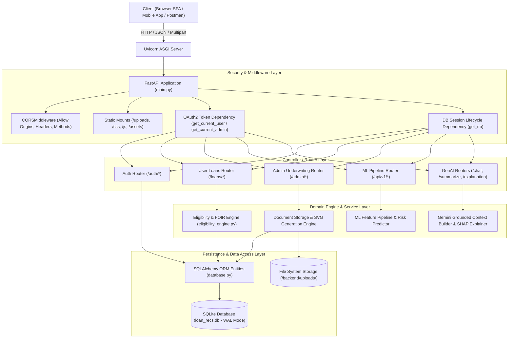
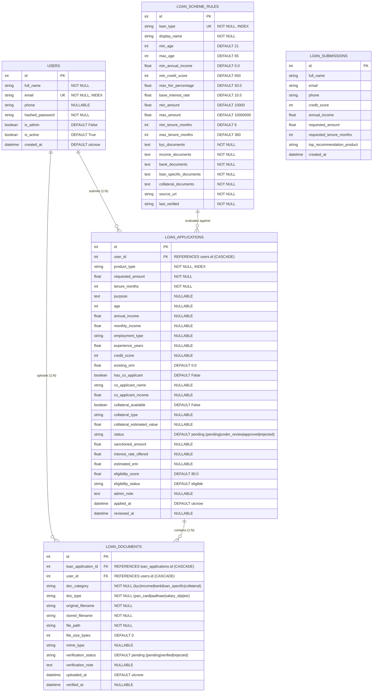
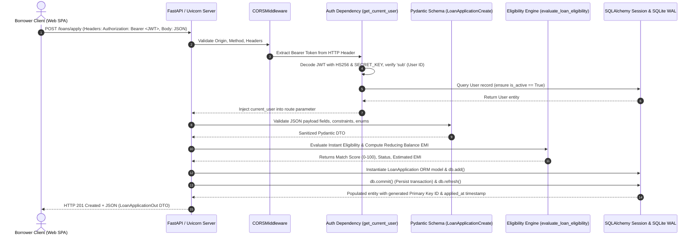
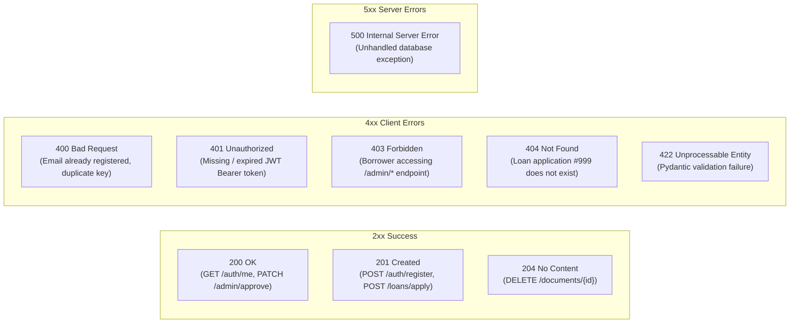
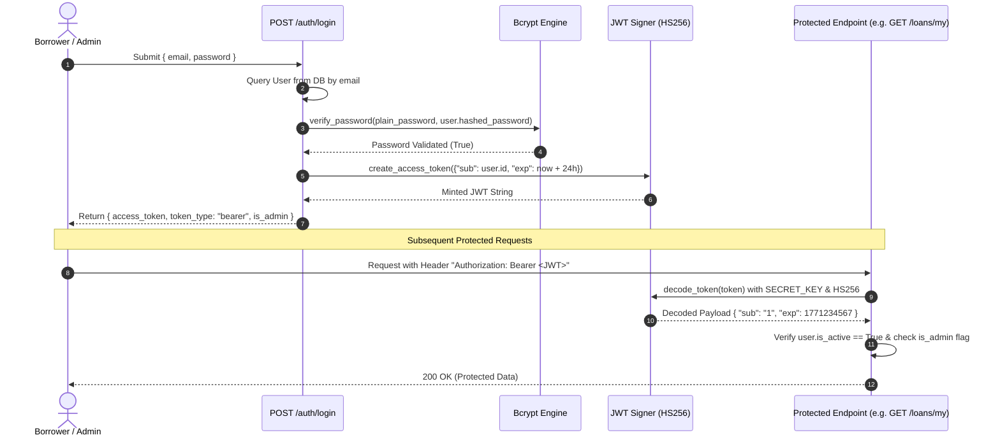
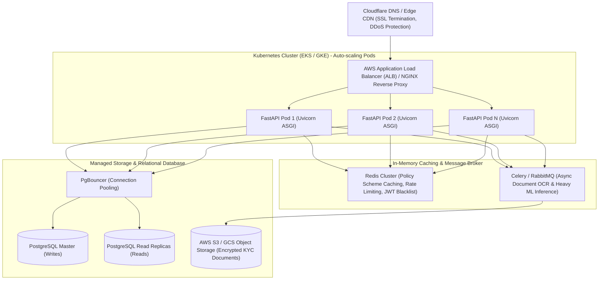

# 🚀 Complete Backend Master Architecture & Interview Preparation Guide
### **Project**: Intelligent Loan Management, Underwriting & ML Recommendation Platform (`TEAM-DSA`)
### **Target Audience**: Backend Engineers, Technical Interviewers, System Designers & Hackathon Evaluators

---

## 📌 Table of Contents
1. [Tech Stack & Tooling Deep-Dive](#1-tech-stack--tooling-deep-dive)
2. [High-Level Architecture & Layered MVC Pattern](#2-high-level-architecture--layered-mvc-pattern)
3. [Database Architecture, Schema & Relationships](#3-database-architecture-schema--relationships)
4. [Request Lifecycle & Data Flow (End-to-End Walkthrough)](#4-request-lifecycle--data-flow-end-to-end-walkthrough)
5. [Complete API Catalog & Route Breakdown (Imported vs Mounted)](#5-complete-api-catalog--route-breakdown)
6. [HTTP Protocol, Methods, Status Codes & Headers in Detail](#6-http-protocol-methods-status-codes--headers-in-detail)
7. [Authentication, Authorization & Security Architecture](#7-authentication-authorization--security-architecture)
8. [Business Logic, Financial Mathematics & GenAI Integration](#8-business-logic-financial-mathematics--genai-integration)
9. [25+ High-Yield Backend Interview Questions & Model Answers](#9-25-high-yield-backend-interview-questions--model-answers)
10. [Production Scaling & System Design Strategy (100k+ req/min)](#10-production-scaling--system-design-strategy)

---

## 1. Tech Stack & Tooling Deep-Dive

| Category | Technology | Version | Purpose in Codebase | Why We Chose It |
| :--- | :--- | :--- | :--- | :--- |
| **Web Framework** | **FastAPI** | `0.141.1` | REST API Gateway, Routing, Dependency Injection | Native async (`async`/`await`), auto-generated OpenAPI/Swagger documentation, lightning-fast execution on Starlette. |
| **ASGI Server** | **Uvicorn** | `0.52.2` | Asynchronous Server Gateway Interface | Production-grade ASGI web server implementation for Python based on `uvloop` and `httptools`. |
| **ORM & Data Layer** | **SQLAlchemy** | `2.0.52` | Object-Relational Mapping & Connection Management | Declarative Base mapping, query composition, eager/lazy loading, connection pooling, SQLite WAL event hooks. |
| **Data Validation** | **Pydantic** | `2.13.4` (V2) | Data Transfer Objects (DTO), Schemas, Type Enforcement | Rust-powered core (V2) for ultra-fast validation, automatic type coercion, regex/field validators, serialization. |
| **Security & JWT** | **Python-Jose** | `3.5.0` | JWT Token Generation & Verification | Cryptographic token creation using `HS256` symmetric signing for stateless authentication. |
| **Password Hashing** | **Bcrypt** | `4.3.0` | Secure Password Hashing | Adaptive cryptographic hashing with auto-generated salts and configurable work factor (resistant to rainbow table and brute-force attacks). |
| **Multipart Parsing** | **Python-Multipart** | `0.0.32` | Form Data & Document Upload Streaming | Handles streaming binary file uploads (`UploadFile`) for applicant KYC, income slips, and property deeds. |
| **GenAI / LLM** | **Google GenAI** | Latest | AI Explainability, Summary & Conversational Chat | Grounded LLM reasoning (Gemini) with strict prompt boundaries and SHAP risk driver explanations. |
| **ML Inference** | **XGBoost / Scikit-Learn** | `>=2.0.0` / `>=1.4.0` | Underwriting Risk Classifier & Product Ranking | Credit risk probability estimation, applicant scoring, and candidate loan product ranking. |
| **Database** | **SQLite (WAL Mode)** | Native | Relational Persistence | Zero-configuration SQL persistence configured with Write-Ahead Logging (WAL) and busy timeout handlers for concurrency. |

---

## 2. High-Level Architecture & Layered MVC Pattern

The backend follows a **Modular Clean Layered Architecture** (Controller-Service-Repository pattern) adapted for modern async Python:



### **Architectural Separation of Concerns**:
1. **Presentation / Router Layer (`backend/routers/`)**: Receives HTTP requests, parses headers/parameters, invokes authentication guards, and delegates to business engines.
2. **DTO / Validation Layer (`backend/schemas.py`)**: Defines Pydantic models for incoming request bodies (`LoanApplicationCreate`, `UserRegister`) and outgoing responses (`LoanApplicationOut`, `Token`), sanitizing data.
3. **Domain & Engine Layer (`backend/eligibility_engine.py`, `backend/auth.py`, `ml/src/`)**: Pure business logic (FOIR calculation, Reducing Balance EMI math, SHAP tree explainability, password hashing).
4. **Data Access Layer (`backend/database.py`)**: Declares database entities, relationships, foreign keys, and manages session lifecycle.

---

## 3. Database Architecture, Schema & Relationships

### **Entity-Relationship Diagram (ERD)**



### **Database Concurrency & Transaction Management**
- **WAL Mode (Write-Ahead Logging)**: SQLite by default locks the whole database file on writes. We inject SQLite PRAGMA event listeners on connection:
  ```python
  @event.listens_for(engine, "connect")
  def set_sqlite_pragma(dbapi_connection, connection_record):
      cursor = dbapi_connection.cursor()
      cursor.execute("PRAGMA journal_mode=WAL")       # Concurrent reads while writing
      cursor.execute("PRAGMA synchronous=NORMAL")     # Faster commits with durability
      cursor.execute("PRAGMA busy_timeout=5000")      # Wait up to 5s before busy error
      cursor.close()
  ```
- **Session Lifecycle via Dependency Injection**:
  ```python
  def get_db():
      db = SessionLocal()
      try:
          yield db       # Injected into route handler
      finally:
          db.close()     # Guaranteed closure even on exceptions (prevents connection leaks)
  ```

---

## 4. Request Lifecycle & Data Flow (End-to-End Walkthrough)

### **Example: Submitting a Loan Application (`POST /loans/apply`)**



---

## 5. Complete API Catalog & Route Breakdown

### **Classification: Imported / Mounted Routers in `main.py`**
In FastAPI, routes are organized into modular `APIRouter` instances in separate files, then **imported** and **included** into the central `app` instance in `backend/main.py`:

```python
# main.py imports & router registration:
from routers.auth_router import router as auth_router        # /auth/*
from routers.user_router import router as user_router        # /loans/*
from routers.admin_router import router as admin_router      # /admin/*
from routers.summarize import router as summarize_router     # /summarize
from routers.explanation import router as explanation_router # /explanation
from routers.chat import router as chat_router               # /chat
from src.api.routes import router as ml_router               # /api/v1/*

app.include_router(auth_router)
app.include_router(user_router)
app.include_router(admin_router)
app.include_router(summarize_router)
app.include_router(explanation_router)
app.include_router(chat_router)
app.include_router(ml_router)
```

---

### 📋 **Master Endpoint Directory**

#### **1. Authentication Endpoints (`/auth`)**
| Method | Route Path | Access Level | Request Payload | Response Schema | Status Code | Description |
| :--- | :--- | :--- | :--- | :--- | :--- | :--- |
| `POST` | `/auth/register` | **Public** | `UserRegister` (`full_name`, `email`, `password`, `phone`) | `UserOut` | `201 Created` | Registers new borrower; hashes password with Bcrypt; checks email uniqueness. |
| `POST` | `/auth/login` | **Public** | `UserLogin` (`email`, `password`) | `Token` (`access_token`, `token_type`, `is_admin`, `user_id`) | `200 OK` | Verifies Bcrypt hash; mints signed JWT bearer token. |
| `GET` | `/auth/me` | **Protected** (Borrower/Admin) | *None* | `UserOut` | `200 OK` | Returns logged-in user profile decoded from JWT claims. |

---

#### **2. Consumer & Loan Application Endpoints (`/loans`)**
| Method | Route Path | Access Level | Request Payload / Params | Response Schema | Status Code | Description |
| :--- | :--- | :--- | :--- | :--- | :--- | :--- |
| `GET` | `/loans/schemes` | **Public** | *None* | `List[LoanSchemeRuleOut]` | `200 OK` | Returns policy criteria, age bounds, interest rates, and required document checklists for all 6 loan types. |
| `GET` | `/loans/schemes/{loan_type}` | **Public** | Path: `loan_type` (`personal_loan`, `home_loan`, `vehicle_loan`, `education_loan`, `business_loan`, `gold_loan`) | `LoanSchemeRuleOut` | `200 OK` | Returns specific scheme policy & checklist by type. |
| `POST` | `/loans/check-eligibility` | **Public** | `EligibilityCheckRequest` (Income, Credit, Age, EMI, Specifics) | `EligibilityCheckResponse` | `200 OK` | Runs multi-tier hard filtering, calculates FOIR, and returns sorted eligible loans + advice. |
| `POST` | `/loans/apply` | **Protected** (Borrower) | `LoanApplicationCreate` (Product type, requested amount, tenure, demographics, category fields) | `LoanApplicationOut` | `201 Created` | Submits complete loan application; triggers automatic eligibility scoring; sets status to `pending`. |
| `GET` | `/loans/my` | **Protected** (Borrower) | *None* | `List[LoanApplicationOut]` | `200 OK` | Retrieves all loan applications submitted by the authenticated borrower. |
| `GET` | `/loans/{loan_id}` | **Protected** (Owner / Admin) | Path: `loan_id` | `LoanApplicationOut` | `200 OK` | Retrieves single application details + nested uploaded documents list. |
| `POST` | `/loans/{loan_id}/documents` | **Protected** (Owner / Admin) | `multipart/form-data`: `file`, `doc_category`, `doc_type`, `verification_note` | `DocumentOut` | `201 Created` | Streams binary document to disk (`uploads/{user_id}/{loan_id}/`) and records document metadata. |
| `GET` | `/loans/{loan_id}/documents` | **Protected** (Owner / Admin) | Path: `loan_id` | `List[DocumentOut]` | `200 OK` | Lists all documents uploaded for the loan application. |
| `DELETE`| `/loans/{loan_id}/documents/{doc_id}` | **Protected** (Owner / Admin) | Path: `loan_id`, `doc_id` | *None* | `204 No Content` | Removes document from disk storage and deletes database record. |

---

#### **3. Underwriting & Admin Management Endpoints (`/admin`)**
| Method | Route Path | Access Level | Request Payload / Params | Response Schema | Status Code | Description |
| :--- | :--- | :--- | :--- | :--- | :--- | :--- |
| `GET` | `/admin/loans` | **Admin Only** | Query: `status`, `product_type`, `search` | `List[LoanApplicationOut]` | `200 OK` | Searches and filters loan portfolio across all 6 loan types. |
| `GET` | `/admin/loans/{loan_id}` | **Admin Only** | Path: `loan_id` | `LoanApplicationOut` | `200 OK` | Full underwriter inspection view of application & attached documents. |
| `PATCH` / `PUT` / `POST` | `/admin/loans/{loan_id}/status` | **Admin Only** | `AdminLoanUpdate` (`status`, `admin_note`, `sanctioned_amount`, `interest_rate_offered`) | `LoanApplicationOut` | `200 OK` | Updates loan lifecycle status (`pending`, `under_review`, `approved`, `rejected`). |
| `POST` / `PATCH` | `/admin/loans/{loan_id}/approve` | **Admin Only** | `AdminLoanUpdate` | `LoanApplicationOut` | `200 OK` | Approves loan, records sanction amount and interest rate offered. |
| `POST` / `PATCH` | `/admin/loans/{loan_id}/reject` | **Admin Only** | `AdminLoanUpdate` | `LoanApplicationOut` | `200 OK` | Rejects application with underwriter explanation note. |
| `GET` | `/admin/loans/{loan_id}/documents` | **Admin Only** | Path: `loan_id` | `List[DocumentOut]` | `200 OK` | Lists all attached documents for verification review. |
| `POST` / `PATCH` | `/admin/loans/{loan_id}/documents/{doc_id}/verify` | **Admin Only** | `DocumentVerifyPayload` (`verification_status`, `verification_note`) | `DocumentOut` | `200 OK` | Marks document as `verified` or `rejected`. |
| `GET` | `/admin/loans/{loan_id}/documents/{doc_id}/download` | **Admin / Token Query** | Query: `?token=<JWT>` | Binary File Stream / SVG | `200 OK` | Downloads physical file (or dynamically generated cryptographic SVG fallback). |
| `GET` | `/admin/loans/{loan_id}/documents/{doc_id}/view` | **Admin / Token Query** | Query: `?token=<JWT>` | Inline Preview (PDF/Image/SVG) | `200 OK` | Inline preview stream for embedded iframes / modal inspection. |
| `GET` | `/admin/stats` | **Admin Only** | *None* | `AdminStats` | `200 OK` | Aggregates portfolio analytics: total applications, status breakdown, loan type volume distribution. |
| `GET` | `/admin/users` | **Admin Only** | *None* | `List[UserOut]` | `200 OK` | Lists all registered borrower accounts. |

---

#### **4. Machine Learning & Explainability Endpoints (`/api/v1`)**
| Method | Route Path | Access Level | Request Payload | Response Schema | Status Code | Description |
| :--- | :--- | :--- | :--- | :--- | :--- | :--- |
| `POST` | `/api/v1/recommend` | **Public** | `LoanRecommendationRequest` | `LoanRecommendationResponse` | `200 OK` | Full ML pipeline: validation, feature engineering, eligibility, XGBoost risk scoring, pricing, affordability filtering, candidate ranking, and SHAP explainability. |
| `GET` | `/api/v1/health` | **Public** | *None* | `HealthResponse` | `200 OK` | Verifies ML model artifact availability (`risk_model`, `ranking_model`, `preprocessor`). |
| `POST` | `/api/v1/reload-models` | **Admin** | *None* | `{"status": "ok", ...}` | `200 OK` | Hot-reloads ML pickle & pipeline artifacts from disk without server restart. |

---

#### **5. GenAI Intelligence Endpoints (`/chat`, `/summarize`, `/explanation`)**
| Method | Route Path | Access Level | Request Payload | Response Schema | Status Code | Description |
| :--- | :--- | :--- | :--- | :--- | :--- | :--- |
| `POST` | `/chat` | **Public** | `ChatRequest` (`question`, `recommendation_context`) | `ChatResponse` | `200 OK` | Backend-grounded conversational assistant powered by Gemini. Grounded on ML recommendations with strict safety guardrails. |
| `POST` | `/summarize` | **Public** | `SummarizeRequest` (`top_recommendations`) | `SummarizeResponse` | `200 OK` | Generates concise natural language summary of top loan offers. |
| `POST` | `/explanation` | **Public** | `LoanRecommendationResponse` | `ExplanationOutput` | `200 OK` | Generates deterministic SHAP-driven factor explanations. |

---

#### **6. Core Gateway & Static Endpoints**
| Method | Route Path | Description | Response Code |
| :--- | :--- | :--- | :--- |
| `GET` | `/health` | Gateway Liveness & Health Probe (`{"status": "ok", "version": "2.5.0"}`) | `200 OK` |
| `GET` | `/` | Serves Single Page Web Application (`frontend/index.html`) | `200 OK` |
| `GET` | `/favicon.ico` | Favicon Delivery | `200 OK` / `204 No Content` |
| `GET` | `/contacts` | Legacy contacts listing | `200 OK` |
| `POST` | `/recommend` | Legacy recommendation endpoint | `200 OK` |

---

## 6. HTTP Protocol, Methods, Status Codes & Headers in Detail

### **A. HTTP Methods & Idempotency**

| HTTP Method | Used in Routes | Idempotent? | Safe? | Semantics in our Program |
| :--- | :--- | :--- | :--- | :--- |
| **`GET`** | `/loans/schemes`, `/admin/stats`, `/auth/me` | **Yes** | **Yes** | Read-only. Does not mutate server state. Can be safely cached or retried. |
| **`POST`** | `/auth/register`, `/loans/apply`, `/loans/{id}/documents` | **No** | **No** | Creates a new resource or triggers state transformation. Multiple identical requests produce multiple records. |
| **`PUT`** | `/admin/loans/{id}/status` | **Yes** | **No** | Replaces or sets resource state. Executing multiple times results in the exact same state. |
| **`PATCH`**| `/admin/loans/{id}/approve`, `/admin/loans/{id}/documents/{doc_id}/verify` | **No / Yes** | **No** | **Partial update**. Modifies only specified fields (e.g. updating `status` and `admin_note` without affecting `requested_amount`). |
| **`DELETE`**| `/loans/{id}/documents/{doc_id}` | **Yes** | **No** | Deletes target resource. First call returns `204`; subsequent calls return `404` (state remains deleted). |
| **`OPTIONS`**| Pre-flight requests handled by `CORSMiddleware` | **Yes** | **Yes** | Browser checks permitted HTTP headers, origins, and methods before making cross-origin requests. |

---

### **B. HTTP Status Codes Used & When They Fire**



---

### **C. HTTP Request & Response Headers in Our System**

1. **`Authorization: Bearer <JWT_TOKEN>`**: Transmitted by clients in the request header to prove identity on protected routes.
2. **`Content-Type`**:
   - `application/json`: Standard REST payload format.
   - `multipart/form-data; boundary=...`: Used for binary document uploads (`UploadFile`).
   - `image/svg+xml` / `application/pdf`: Returned by document view/download endpoints.
3. **`Content-Disposition`**:
   - `inline; filename="doc.pdf"`: Instructs browser to render file inside browser window or `<iframe>`.
   - `attachment; filename="document_12.svg"`: Prompts browser to trigger "Save As" download dialogue.
4. **`WWW-Authenticate: Bearer`**: Returned in `401 Unauthorized` responses to indicate required authentication scheme.
5. **CORS Headers (`Access-Control-Allow-*`)**: Automatically populated by `CORSMiddleware` to allow web browsers on different domains/ports to access the API.

---

## 7. Authentication, Authorization & Security Architecture

### **Stateless JWT + Bcrypt Security Architecture**



### **Key Security Implementations**:
1. **Direct Bcrypt Hashing (`auth.py`)**:
   - Avoids legacy library incompatibilities by calling native `bcrypt.hashpw()` with random salt generation.
   - Irreversible one-way cryptographic hash with computational work factor.
2. **JWT Payload Structure**:
   - `sub`: Subject identifier (stringified integer `user.id`).
   - `exp`: Expiration Unix epoch timestamp (configured for 24 hours).
   - Cryptographically signed with secret key (`HS256`).
3. **Role-Based Access Control (RBAC)**:
   - `get_current_user`: Verifies token and yields regular active user.
   - `get_current_admin`: Composes `get_current_user` and enforces `current_user.is_admin == True`, raising `403 Forbidden` if unauthorized.

---

## 8. Business Logic, Financial Mathematics & GenAI Integration

### **A. Reducing Balance Monthly EMI Formula**

The Monthly Equated Installment (EMI) on a reducing balance loan is derived mathematically as:

$$\text{EMI} = \frac{P \times r \times (1 + r)^n}{(1 + r)^n - 1}$$

Where:
- $P$ = Principal Loan Amount (e.g. ₹5,00,000)
- $r$ = Monthly interest rate = $\frac{\text{Annual Rate (\%)}}{100 \times 12}$
- $n$ = Tenure in total months (e.g. 36 months)

*Code implementation in [`eligibility_engine.py`](file:///c:/Users/Aditya/OneDrive/AppData/Documents/Desktop/TEAM-DSA/backend/eligibility_engine.py#L15-L28)*:
```python
def calculate_emi(principal: float, annual_rate_pct: float, tenure_months: int) -> float:
    if principal <= 0 or tenure_months <= 0:
        return 0.0
    if annual_rate_pct <= 0:
        return round(principal / tenure_months, 2)
    
    monthly_rate = (annual_rate_pct / 100.0) / 12.0
    numerator = principal * monthly_rate * math.pow(1 + monthly_rate, tenure_months)
    denominator = math.pow(1 + monthly_rate, tenure_months) - 1
    return round(numerator / denominator, 2) if denominator != 0 else 0.0
```

---

### **B. Fixed Obligation to Income Ratio (FOIR) & Max Loan Capacity**

$$\text{FOIR (\%)} = \frac{\text{Existing Monthly EMIs} + \text{Proposed Monthly EMI}}{\text{Effective Monthly Income}} \times 100$$

To calculate the maximum loan a borrower can afford given their disposable income:
$$\text{Available Monthly EMI} = (\text{Monthly Income} \times \text{Max FOIR \%}) - \text{Existing EMI}$$

$$P_{\text{max}} = \text{Available Monthly EMI} \times \frac{(1 + r)^n - 1}{r \times (1 + r)^n}$$

---

### **C. The 6 Loan Scheme Configurations & Criteria**

1. **Personal Loan**: Unsecured, 0% down payment, Min Age 21-60, Credit Score $\ge$ 680, FOIR $\le$ 45%, Base Rate 10.99%.
2. **Home Loan / Housing Finance**: Secured by equitable mortgage, Min 10%-20% down payment, Min Income ₹3,60,000/yr, Credit Score $\ge$ 650, FOIR $\le$ 55%, Base Rate 8.40%, Tenure up to 360 months.
3. **Vehicle / Car Loan**: Secured by vehicle hypothecation (RTO Form 20/34), 10%-20% down payment, Min Income ₹3,00,000/yr, Base Rate 8.95%, Tenure up to 84 months.
4. **Education Loan**: Mandatory co-borrower parent, Moratorium period (course + 12 mo), Nil collateral up to ₹7.5L, Base Rate 9.25%.
5. **Business / MSME Loan**: Promoter vintage $\ge$ 2 yrs, turnover $\ge$ ₹20L, DSCR $\ge$ 1.25, FOIR $\le$ 60%, Base Rate 11.50%.
6. **Gold Loan**: Mandatory physical pledge of gold jewellery (18k-24k), RBI LTV ceiling of 75%, Credit score flexible, Base Rate 8.75%.

---

### **D. GenAI Explainability & Grounding Architecture (`/chat`, `/explanation`)**
- **Trust Boundary & Context Builder**: Does not blindly feed unverified prompts to the LLM. 
- Filters and ranks SHAP feature importance scores deterministically in Python (`generate_shap_explanation`).
- Passes validated ML scores and risk drivers into Gemini with strict system instructions: "You are an underwriting assistant. Ground all claims in the provided structured risk context. Never fabricate approval guarantees."

---

## 9. 25+ High-Yield Backend Interview Questions & Model Answers

### **Core Framework & Architecture**

#### **Q1: Why did you choose FastAPI over Django or Flask for this project?**
> **Answer**: 
> 1. **High Concurrency & Async I/O**: FastAPI is built on Starlette and Uvicorn, giving native ASGI asynchronous performance matching Node.js/Go.
> 2. **Automated Serialization & Validation**: Pydantic V2 enforces compile/runtime schema validation with native C/Rust speed.
> 3. **Auto-Generated OpenAPI / Swagger UI**: Out-of-the-box interactive documentation at `/docs` and schema export at `/openapi.json`.
> 4. **Modern Dependency Injection**: FastAPI's `Depends()` cleanly decouples database session lifecycles, authentication checks, and admin permission guards from route logic.

#### **Q2: What is the difference between WSGI and ASGI? Why does Uvicorn matter?**
> **Answer**:
> - **WSGI (Web Server Gateway Interface)** (e.g. Flask/Django with Gunicorn) is synchronous and blocking. A thread is pinned per request.
> - **ASGI (Asynchronous Server Gateway Interface)** (e.g. FastAPI with Uvicorn) supports async coroutines (`async def`), non-blocking event loops, WebSockets, and long-polling. Uvicorn uses `uvloop` (an ultra-fast C implementation of the asyncio event loop) to handle thousands of concurrent requests on a single thread.

#### **Q3: What is the difference between `PUT` and `PATCH` in REST APIs? Where are they used in your code?**
> **Answer**:
> - **`PUT`** represents full replacement of a resource entity.
> - **`PATCH`** represents partial modification of specific fields.
> - In our application, `/admin/loans/{id}/status` and `/admin/loans/{id}/approve` use `PATCH` because the underwriter is only modifying specific attributes (`status`, `sanctioned_amount`, `admin_note`) while preserving all borrower demographics, uploaded documents, and timestamps.

#### **Q4: How does FastAPI's Dependency Injection (`Depends`) work under the hood?**
> **Answer**:
> FastAPI analyzes route function signatures using Python reflection (`inspect`). When it encounters `Depends(get_db)` or `Depends(get_current_user)`, it builds a dependency graph, executes the dependency functions prior to entering the route, and injects their return values into the route parameters. If a dependency uses `yield` (like our `get_db()`), FastAPI executes the teardown logic (closing the database session) after the response is sent, even if an unhandled exception occurred.

---

### **Database, Concurrency & ORM**

#### **Q5: How did you solve database locking and concurrency in SQLite?**
> **Answer**:
> SQLite defaults to rollback journal mode where writers block all readers. We configured **Write-Ahead Logging (WAL)** via SQLAlchemy event listeners (`PRAGMA journal_mode=WAL; PRAGMA busy_timeout=5000; PRAGMA synchronous=NORMAL;`). In WAL mode, changes are appended to a separate `-wal` file, allowing readers to read the main database file concurrently while a write occurs without locking the database.

#### **Q6: What is the N+1 query problem, and how do you prevent it in SQLAlchemy?**
> **Answer**:
> The N+1 problem occurs when fetching a parent collection (N records) and lazily issuing an additional SQL query for each parent's children (N additional queries). In our system, when fetching a `LoanApplication`, we retrieve associated documents using `joinedload` or relationship definitions (`relationship("LoanDocument", back_populates="loan_application", cascade="all, delete-orphan")`), allowing SQLAlchemy to join the tables in a single SQL query.

#### **Q7: What does `cascade="all, delete-orphan"` mean in your `User` and `LoanApplication` models?**
> **Answer**:
> It enforces relational integrity at the ORM level. If a `User` account is deleted, all their associated `LoanApplication` records and `LoanDocument` records are automatically cascaded and deleted. Similarly, removing a document from an application's `documents` list marks it as an orphan and issues an automatic SQL `DELETE`.

---

### **Authentication & Security**

#### **Q8: Why is JWT considered stateless, and how does it compare to session-based auth?**
> **Answer**:
> - **Session Auth**: Requires the server to store a session ID in memory or Redis and look it up on every request.
> - **JWT (JSON Web Token)**: The token itself contains the user claims (`sub`, `exp`) cryptographically signed with a secret key. The server validates the cryptographic signature mathematically without needing to hit a database or cache, making it horizontally scalable across multiple server instances.

#### **Q9: How does Bcrypt prevent rainbow table and brute-force attacks?**
> **Answer**:
> Bcrypt incorporates:
> 1. **Automatic Salt Generation**: A random 128-bit salt is hashed alongside the password, ensuring identical passwords generate completely different hashes, neutralizing precomputed rainbow tables.
> 2. **Configurable Work Factor (Cost Parameter)**: Bcrypt is intentionally slow and CPU/memory-intensive, making brute-force hardware cracking mathematically impractical.

#### **Q10: What is the difference between Authentication (401) and Authorization (403)?**
> **Answer**:
> - **401 Unauthorized**: "Who are you?" The client failed to provide valid credentials (missing, invalid, or expired JWT).
> - **403 Forbidden**: "I know who you are, but you don't have permission." A valid borrower with a genuine token attempts to call an underwriting endpoint (`/admin/loans/approve`), which triggers our `get_current_admin` dependency and halts with `403`.

---

### **File Uploads & Data Streaming**

#### **Q11: Why use `UploadFile` instead of `bytes` in FastAPI file upload endpoints?**
> **Answer**:
> `bytes` reads the entire uploaded file into memory at once, which causes out-of-memory (OOM) crashes if users upload large files (e.g. 50MB PDFs). `UploadFile` stores file contents in a SpooledTemporaryFile stream (in memory up to a rollover size, then rolling over to disk), allowing efficient streaming with `await file.read()` and `shutil.copyfileobj()`.

#### **Q12: How do you secure document download endpoints against Unauthorized Access?**
> **Answer**:
> 1. We verify that the requesting user is either the application owner (`doc.user_id == current_user.id`) or has administrative privileges (`current_user.is_admin == True`).
> 2. For browser preview tabs where custom `Authorization` headers cannot be attached by standard HTML elements, we support query-param tokens (`?token=<JWT>`), validating the token signature before streaming the file via `FileResponse`.

---

### **Financial Algorithms & ML Integration**

#### **Q13: How does your Hard Eligibility Engine differ from the ML Recommendation Model?**
> **Answer**:
> - **Hard Eligibility Engine (`eligibility_engine.py`)**: Deterministic policy enforcement based on banking regulations (RBI guidelines, minimum age, minimum income, maximum FOIR $\le$ 50%, LTV $\le$ 75%). It acts as a hard filter.
> - **ML Recommendation Model (`/api/v1/recommend`)**: Probabilistic ranking and risk scoring using XGBoost and Calibrated Classifiers. It evaluates creditworthiness, default probability, and ranks candidate offers based on customer utility and interest rate optimization.

#### **Q14: Explain the reducing balance EMI formula and how interest is calculated.**
> **Answer**:
> In reducing balance, interest is charged only on the outstanding principal at the beginning of each month, not the initial loan amount. As the borrower pays each monthly EMI, a portion goes toward interest ($P_{\text{remaining}} \times r$) and the remainder reduces the principal, causing the interest component to decrease and principal component to increase each month until the balance hits zero.

---

## 10. Production Scaling & System Design Strategy



### **5 Steps to Scale this Platform to 100,000+ Requests/Minute**:
1. **Database Migration to PostgreSQL + Read Replicas**:
   - Replace SQLite with managed AWS Aurora PostgreSQL.
   - Separate Read (`GET /loans/schemes`, `GET /admin/stats`) and Write operations (`POST /loans/apply`) using read replicas.
   - Use **PgBouncer** connection pooling to maintain persistent database connections across thousands of stateless pods.
2. **Redis In-Memory Caching**:
   - Cache static bank scheme policies (`/loans/schemes`) with a TTL of 24 hours.
   - Cache credit score band mappings and reducing balance math lookups.
   - Implement sliding-window rate limiting per IP / User ID.
3. **Asynchronous Background Processing (Celery + Redis)**:
   - Offload heavy tasks (document OCR parsing, virus scanning, PDF rendering, SHAP explanations) to asynchronous background workers.
4. **Cloud Object Storage (AWS S3 / GCS)**:
   - Move document file storage from local disk (`/backend/uploads/`) to S3 with AES-256 server-side encryption and Pre-signed URLs for secure direct uploads.
5. **Docker Containerization & Kubernetes Horizontal Pod Autoscaling (HPA)**:
   - Package FastAPI with a multi-stage Docker build.
   - Deploy on Kubernetes behind NGINX / AWS ALB with CPU/memory-based auto-scaling (HPA).

---

## 🎯 Quick Revision Cheat Sheet for Interview Day

| Concept | Key Phrase to Tell Interviewer |
| :--- | :--- |
| **Framework** | *"FastAPI on ASGI Uvicorn with Pydantic V2 validation and asynchronous non-blocking I/O."* |
| **Auth System** | *"Stateless JWT tokens signed with HS256 combined with salt-hashed Bcrypt passwords and RBAC dependency guards."* |
| **Database** | *"SQLAlchemy 2.0 ORM with generator session management and SQLite Write-Ahead Logging (WAL) concurrency."* |
| **Underwriting** | *"Multi-tier evaluation: Hard policy rule filtering $\rightarrow$ FOIR & Reducing balance EMI calculation $\rightarrow$ XGBoost risk prediction $\rightarrow$ Underwriter sanction workflow."* |
| **Document Storage**| *"Streaming multipart/form-data upload pipeline with file metadata persistence and SVG cryptographic fallback."* |
| **GenAI Grounding** | *"Deterministic SHAP explainability context builder with Gemini LLM natural language generation bounded by strict safety prompt boundaries."* |
